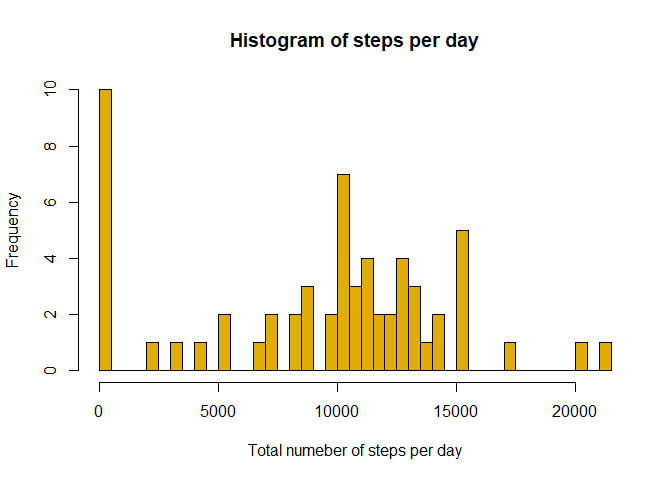
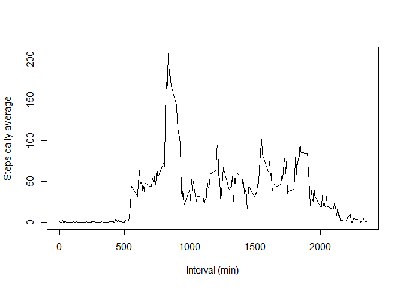
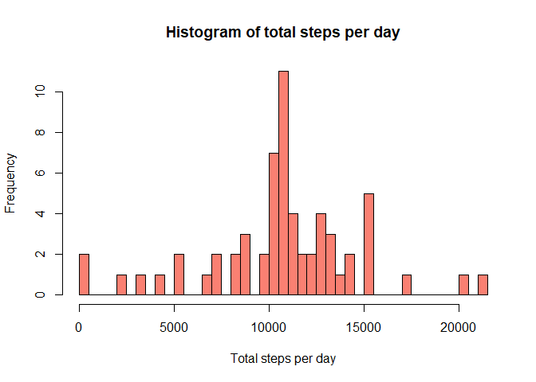
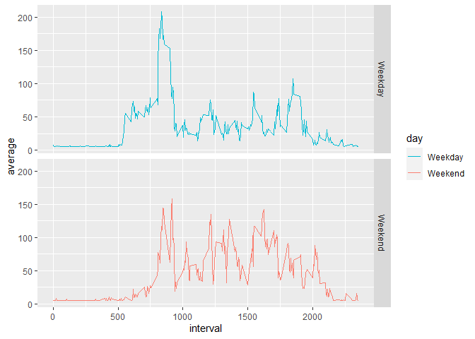

## Loading and preprocessing the data

```r
filename <- unzip("repdata_data_activity.zip")
data <- read.table(filename, sep = ",", header = TRUE)
data$date <- as.Date(data$date)
```


## What is mean total number of steps taken per day?

Define `data_steps` which gives the total number of steps fore each day:

```r
data_steps <- data %>% group_by(date) %>% summarise( total_steps = sum(steps,  na.rm = TRUE))
```

Plotting the histogram of total number of steps per day:


```r
hist(data_steps$total_steps, 
     xlab = "Total numeber of steps per day", 
     main = "Histogram of steps per day", 
     breaks = 50, 
     col = "#e1ad01")
```

<!-- -->

Calculating the mean and median for daily total number of steps gives 

```r
mean_daily_steps <- mean(data_steps$total_steps, na.rm = TRUE)
median_daily_steps <- median(data_steps$total_steps, na.rm = TRUE)
```

The mean and the median for total number of steps per day are **9,354** and **10,395**


## What is the average daily activity pattern?

Define `data_daily` which gives the daily average steps for each interval:


```r
data_daily <- aggregate(x = list(daily_mean = data$steps), 
                        by = list(interval = data$interval), 
                        FUN = mean, 
                        na.rm = TRUE)
```

Plotting the daily interval

```r
plot(x = data_daily$interval, y = data_daily$daily_mean, 
     xlab = "Interval (min)", ylab = "Steps daily average", type = "l")
```

<!-- -->


```r
max_interval <- data_daily[data_daily$daily_mean == max(data_daily$daily_mean),]$interval
```

The interval with the maximum average steps is **835**.

## Imputing missing values

Calculating the total number of NAs:

```r
NA_nr <- sum(is.na(data))
```
The total number of missing values is **2304**.

Calculating a replacement value for the days where all values in all intervals are NA:

```r
replacement_value <- mean(data[!is.na(data$steps),]$steps)
```

For other days where the number of steps are missing values only in some intervals, impute function is called to replace the missing values with the mean of non-missing values for that day. Below is the definition of impute funtion:


```r
imputes <- function(x) replace(x, is.na(x), 
                               if(is.na(mean(x, na.rm = TRUE))) replacement_value 
                               else mean(x, na.rm = TRUE))
```

Define `new_data` instead of `data` with replacement values:

```r
new_data <- data %>% group_by(date) %>% summarise (steps = imputes(steps), interval = interval)
```

```
## `summarise()` has grouped output by 'date'. You can override using the `.groups` argument.
```

`new_data_daily`gives the daily average steps for each interval while the missing values are replaced with mean value for each day.

```r
new_data_daily <- new_data %>% group_by(date) %>% summarise (total = sum(steps))
```


Plotting the histogram is shown in the figure below:


```r
hist(new_data_daily$total, 
     xlab = "Total steps per day",
     main = "Histogram of total steps per day", 
     breaks = 50,
     col = "#FA8072")
```

<!-- -->

Calculating the mean and median after replacing missing values:


```r
new_mean_daily_steps_ <- mean(new_data_daily$total)
new_median_daily_steps <- median(new_data_daily$total)
```

The mean and median of the total daily steps with replacement value for NAs in data are **10,766** and **10,766**, respectively. This compares to **9,354** and **10,395** for data without missing values, which are fairly close. 

## Are there differences in activity patterns between weekdays and weekends?

Define `day` column in `new_data` for showing days of the week as in Monday, Tuesday, etc :


```r
new_data$day <- weekdays(new_data$date)
```

Define `weekend` function to decide whether a day such as Saturday is a weekday or weekend:

```r
weekend <- function(x) if (x == "Saturday" | x == "Sunday") "Weekend" else "Weekday"
```

Updating the `day` column in `new_data` with weekday or weekend instead of Monday, Tuesday, etc

```r
new_data$day <- sapply(new_data$day, weekend)
```

Calculating the average number of steps for each interval in all weekdays as well as all weekends:

```r
new_data_daily_interval <- new_data %>% group_by(day, interval) 
new_data_daily_interval <- summarise(new_data_daily_interval, average = mean(steps))
```

```
## `summarise()` has grouped output by 'day'. You can override using the `.groups` argument.
```

Plotting the results:


```r
ggplot(new_data_daily_interval, aes(interval, average))+ 
        geom_line(aes(color = day))+
        scale_color_manual(values=c('#00BCD4','#FA8072'))+
        facet_grid(day ~ .)
```

<!-- -->


